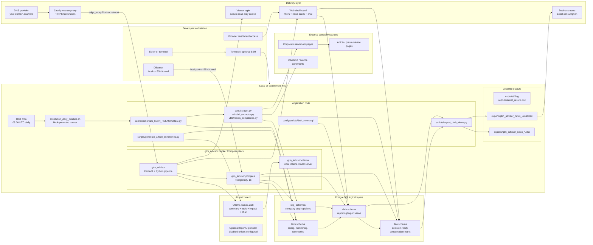
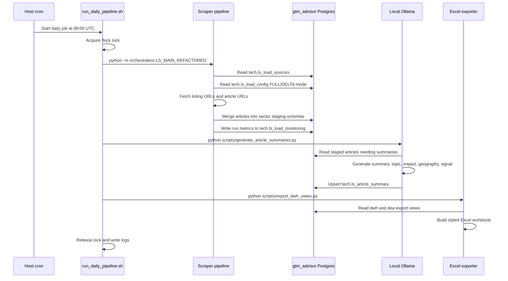
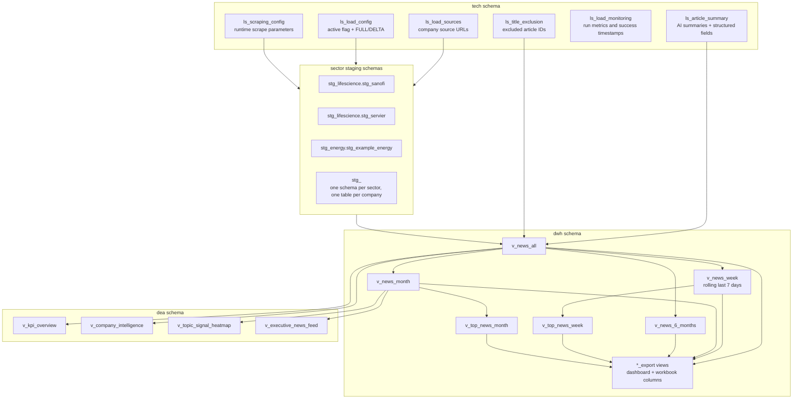
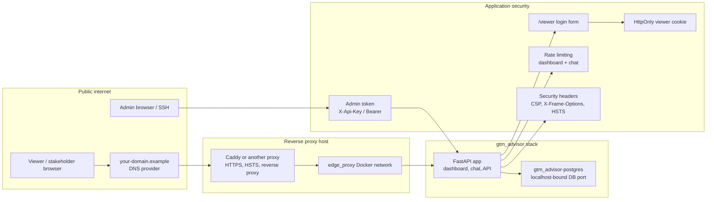

# GTM Advisor Technical Architecture

This document describes the technical architecture behind GTM Advisor. It is intended for engineering reviews, corporate presentations, and handover documentation.

## End-To-End System Schema

## Daily Pipeline Flow

## Database Layer

## Web And Security Path

## Runtime Components

| Layer | Component | Responsibility |
| --- | --- | --- |
| Admin | Developer workstation | Local or remote development and operational control |
| Host | Local machine or deployment server | Runs Docker, Postgres, cron, exports, and optional proxy integration |
| App | `gtm_advisor` container | FastAPI dashboard, API, chat, and operational endpoints |
| Database | `gtm_advisor-postgres` | Dedicated PostgreSQL database for GTM Advisor |
| Ingestion | `orchestration/LS_MAIN_REFACTORED.py` | Main scrape pipeline and company-level loading |
| Scraping | `core/scraper.py`, `utils/*` | Source fetch, robots handling, URL extraction, article parsing |
| AI | `core/llm_client.py`, `scripts/generate_article_summaries.py` | Local Ollama summaries, dashboard chat, and optional OpenAI fallback |
| Reporting | `config/scripts/dwh_views.sql` | DWH views, priority score, top-news/export views, and DEA consumption marts |
| Export | `scripts/export_dwh_views.py` | Styled Excel workbook generation |
| Public site | Reverse proxy + DNS provider | Optional HTTPS reverse proxy and public domain |

## Operational Notes

- The scheduled job runs at `08:00 UTC` from the host crontab when cron is configured.
- `week` in the dashboard means a rolling last-7-days window, not a Monday-start calendar week.
- The app is bound locally and reached publicly only through the reverse proxy path.
- Ollama is also bound locally by Docker Compose and is reached by the app at `http://ollama:11434`.
- Viewer access uses a login form and secure cookie; admin operations require the admin token.
- Dashboard chat responses include the article summaries and URLs used as sources to help users verify the answer.
