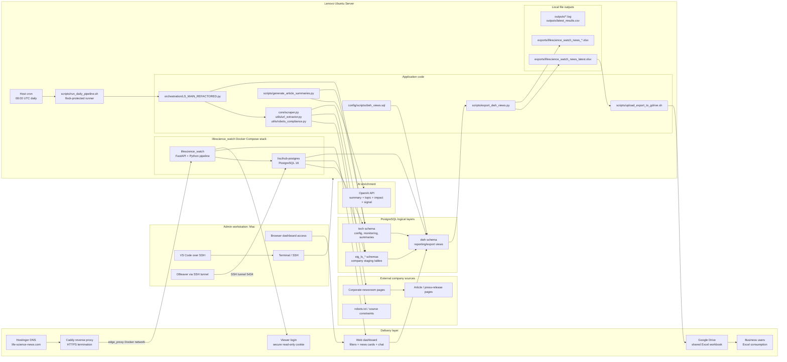
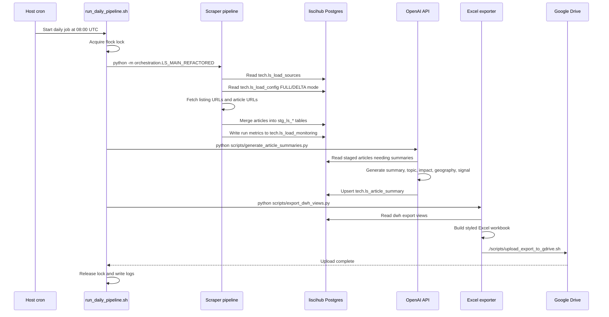
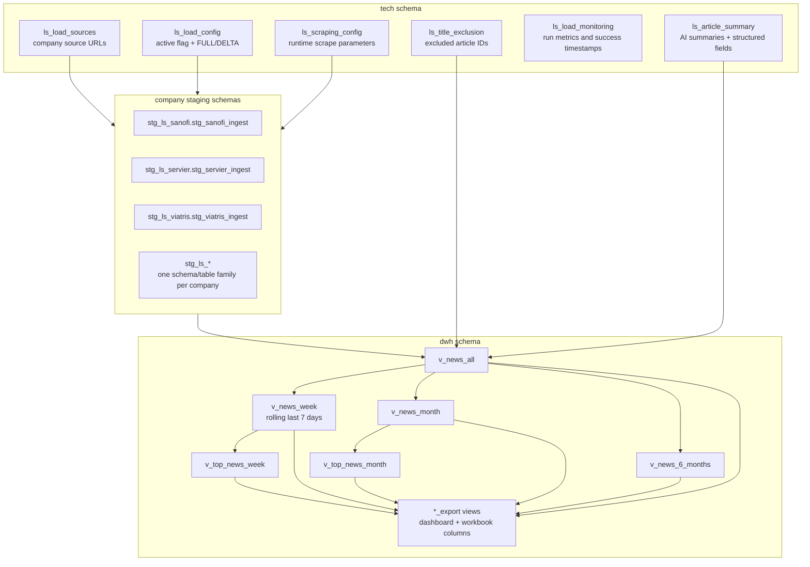
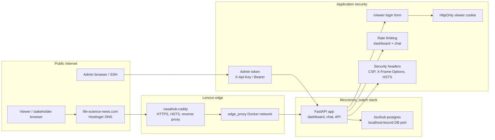

# LISCIHUB Technical Architecture

This document describes the technical architecture behind Life Science Watch / LISCIHUB. It is intended for engineering reviews, corporate presentations, and handover documentation.

## End-To-End System Schema

## Daily Pipeline Flow

## Database Layer

## Web And Security Path

## Runtime Components

| Layer | Component | Responsibility |
| --- | --- | --- |
| Admin | Mac + VS Code SSH | Remote development and operational control |
| Host | Lenovo Ubuntu Server | Runs Docker, Postgres, cron, exports, and proxy integration |
| App | `lifescience_watch` container | FastAPI dashboard, API, chat, and operational endpoints |
| Database | `liscihub-postgres` | Dedicated PostgreSQL database for LISCIHUB |
| Ingestion | `orchestration/LS_MAIN_REFACTORED.py` | Main scrape pipeline and company-level loading |
| Scraping | `core/scraper.py`, `utils/*` | Source fetch, robots handling, URL extraction, article parsing |
| AI | `scripts/generate_article_summaries.py` | OpenAI-backed summaries and structured business-watch fields |
| Reporting | `config/scripts/dwh_views.sql` | DWH views, priority score, top-news/export views |
| Export | `scripts/export_dwh_views.py` | Styled Excel workbook generation |
| Distribution | `scripts/upload_export_to_gdrive.sh` | `rclone` upload to Google Drive |
| Public site | Caddy + Hostinger DNS | HTTPS reverse proxy and public domain |

## Operational Notes

- The scheduled job runs at `08:00 UTC` from the Lenovo host crontab.
- `week` in the dashboard means a rolling last-7-days window, not a Monday-start calendar week.
- The app is bound locally and reached publicly only through the reverse proxy path.
- Viewer access uses a login form and secure cookie; admin operations require the admin token.
- Dashboard chat responses include the article summaries and URLs used as sources to help users verify the answer.
